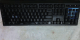

# [my-keyboard](https://github.com/Vulae/my-keyboard)

Custom lighting effects for my Razer keyboard.



If you have a Razer keyboard with lighting & [OpenRazer](https://github.com/openrazer/openrazer) it should just work.

User groups needed: `openrazer` (Required) & `input` (Optional, for key lighting feedback)

# [Usage](#usage)

```groff
Usage: my-keyboard [OPTIONS]

Options:
  -p, --path <PATH>                        Effects directory path or file path
  -w, --watch                              Watch for file changes
  -n, --no-key-events                      If to not listen for keyboard events
  -f, --fps <FPS>                          [default: 20]
  -c, --cycle-time-secs <CYCLE_TIME_SECS>  [default: 300]
  -h, --help                               Print help
  -V, --version                            Print version

Example: my-keyboard --path ./effects/ -w
```

```lua
Keyboard:on_recieve_key(function(type, x, y)
    Log.info("Key " .. type .. ": " .. x .. ", " .. y)
end)

Keyboard:on_matrix_update(function(x, y)
    local hue_rot = (curtime * 100)

    local hue = (x / Keyboard.WIDTH) * 360
    if y % 2 == 0 then
        hue = -hue
    end

    return RGB.from_hsl(hue + hue_rot, 1.0, 0.5)
end)
```

See full definitions: [lib.d.lua](./my-keyboard/src/lib.d.lua)

# [TODO](#todo)

* Windows dynamic lighting ([link](https://learn.microsoft.com/en-us/windows-hardware/design/component-guidelines/dynamic-lighting-devices))
* Razer chroma REST api ([link](https://doc.wyvrn.com/docs/chroma-sdk/chroma-rgb-rest-api/))
* Razer chroma websocket api ([link](https://doc.wyvrn.com/docs/chroma-sdk/chroma-rgb-websocket/))
* Razer C++ SDK ([link](https://doc.wyvrn.com/docs/chroma-sdk/chroma-cpp-sdk/))
    * Either create our own DLL to load. ([Probably impossible](https://github.com/WyvrnOfficial/CSDK_ChromaSDK_GameSample/blob/UNICODE_WITHOUT_DLL/Razer/VerifyLibrarySignature.cpp))
    * Or use official Razer [DLL](https://www.razer.com/chroma) and reverse engineer the communication between the SDK and the Razer drivers.
* Corsair iCUE ([link](https://www.corsair.com/us/en/s/icue))
* Logitech LIGHTSYNC ([link](https://www.logitechg.com/en-us/discover/technology/lightsync-rgb))

# [License](#license)

`MIT-0` / `MIT No Attribution`
i.e. Literally do anything you want with it lmao

